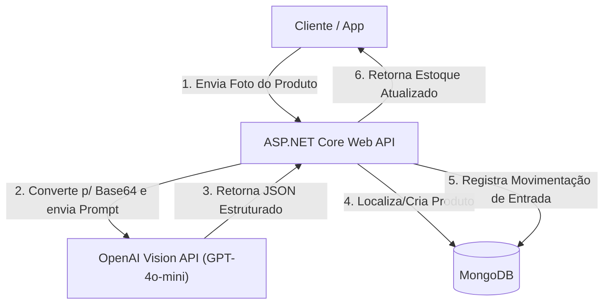

# Grocery.Shopping.API

Logo/Badge status:
[](https://dotnet.microsoft.com/)
[](https://www.mongodb.com/)
[](https://openai.com/)
[](LICENSE)

Uma Web API moderna em **ASP.NET Core (.NET 8)** projetada para controle de despensa e estoque residencial/comercial, com foco em **automação baseada em Inteligência Artificial**. 

Este projeto explora a fusão de Large Language Models (LLMs) com fluxos de desenvolvimento backend robustos, superando as limitações do OCR tradicional. Através da **OpenAI Vision API**, o sistema extrai dados semânticos de imagens de embalagens de produtos e os transforma instantaneamente em dados estruturados (JSON), prontos para persistência em um banco **NoSQL (MongoDB)**.

---

## 🚀 Destaque Tecnológico: Agente de Visão Semântica

Diferente de sistemas OCR tradicionais — que apenas extraem textos brutos e exigem regras regex complexas e frágeis para estruturar informações —, este projeto implementa um **Agente de Reconhecimento Visual**. 

O agente é capaz de:
*   **Compreensão Semântica:** Identificar o nome do produto, marca e categoria mesmo em embalagens com designs complexos ou fontes artísticas.
*   **Inferência de Unidades:** Extrair valores numéricos e unidades de medida de forma separada e padronizada (ex: `5` e `kg`).
*   **Grau de Confiança:** Avaliar a confiabilidade de cada dado extraído em uma escala de `0.0` a `1.0`.
*   **Estruturação Rígida:** Retornar os dados em formato JSON estrito mapeado diretamente para DTOs C#.

---

## 🛠️ Arquitetura e Fluxo de Dados

A arquitetura segue boas práticas de separação de conceitos (Separation of Concerns), dividida em camadas lógicas:



### Divisão de Camadas
*   [Controllers](file:///f:/Projetos/Fagron/Grocery.Shopping.API/Controllers): Endpoints HTTP RESTful (`EstoqueController`, `ProdutosController`).
*   [Application](file:///f:/Projetos/Fagron/Grocery.Shopping.API/Application): Serviços de integração com APIs externas (ex: `ReconhecimentoFotoService`).
*   [Domain](file:///f:/Projetos/Fagron/Grocery.Shopping.API/Domain): Regras de negócio essenciais, entidades e serviços de domínio (`EstoqueService`).
*   [Dtos](file:///f:/Projetos/Fagron/Grocery.Shopping.API/Dtos): Contratos estruturados de entrada e saída.
*   [Infra](file:///f:/Projetos/Fagron/Grocery.Shopping.API/Infra): Camada de persistência contendo as configurações e contexto do MongoDB.

---

## ⚙️ Tecnologias Utilizadas

*   **Backend:** ASP.NET Core Web API com **.NET 8** C#
*   **Banco de Dados:** **MongoDB** (Persistência escalável de documentos NoSQL)
*   **IA de Visão:** **OpenAI Vision API** (`gpt-4o-mini`)
*   **Documentação:** **Swagger / Swashbuckle** para testes iterativos de endpoints
*   **HttpClient Factory:** Comunicação assíncrona otimizada com a OpenAI

---

## 🔌 Endpoints Principais (API)

### 1. Reconhecimento de Produto por Foto
Analisa a imagem enviada e retorna uma sugestão de preenchimento inteligente de dados.

*   **Método:** `POST`
*   **Endpoint:** `/api/Produtos/reconhecer-por-foto`
*   **Content-Type:** `multipart/form-data`
*   **Parâmetro:** `foto` (Arquivo de imagem)

#### Exemplo de Resposta (JSON):
```json
{
  "produtoSugerido": {
    "nomeProduto": { "valor": "Arroz Integral Tipo 1", "confianca": 0.95 },
    "marca": { "valor": "Camil", "confianca": 0.98 },
    "quantidadeUnidade": { "valor": 1, "confianca": 0.99 },
    "unidadeMedida": { "valor": "kg", "confianca": 0.99 },
    "categoriaSugestao": { "valor": "Graos", "confianca": 0.90 },
    "codigoBarras": { "valor": null, "confianca": 0.0 }
  },
  "jaExisteNoCatalogo": false,
  "produtoIdExistente": null,
  "mensagens": []
}
```

### 2. Adicionar Produto ao Estoque
Efetua o cadastro ou atualização do produto no catálogo e registra a entrada de quantidade no estoque.

*   **Método:** `POST`
*   **Endpoint:** `/api/Estoque/adicionar`
*   **Content-Type:** `application/json`

#### Exemplo de Requisição:
```json
{
  "produto": {
    "nome": "Arroz Integral Tipo 1",
    "marca": "Camil",
    "unidadeMedida": "kg",
    "categoria": 1,
    "codigoBarras": "7891910000192"
  },
  "movimentacao": {
    "tipo": 1,
    "quantidadeUnidades": 5,
    "dataVencimento": "2027-06-30T00:00:00Z",
    "motivo": "Abastecimento Mensal"
  }
}
```

---

## 🛠️ Configuração e Execução Local

### Pré-requisitos
*   [.NET SDK 8.0+](https://dotnet.microsoft.com/download/dotnet/8.0)
*   [MongoDB](https://www.mongodb.com/try/download/community) rodando localmente ou instância no MongoDB Atlas
*   Uma chave de API ativa da [OpenAI](https://platform.openai.com/)

### Variáveis de Configuração
As chaves sensíveis devem ser configuradas utilizando **User Secrets** para evitar vazamentos no repositório público.

1.  Inicialize os segredos do projeto:
    ```bash
    dotnet user-secrets init
    ```
2.  Defina as configurações de banco e a chave de API da OpenAI:
    ```bash
    dotnet user-secrets set "OpenAI:ApiKey" "sua-chave-openai-aqui"
    dotnet user-secrets set "Mongo:ConnectionString" "mongodb://localhost:27017"
    dotnet user-secrets set "Mongo:DatabaseName" "GroceryShoppingDb"
    ```

### Executando o Projeto
1.  Restaure as dependências do NuGet:
    ```bash
    dotnet restore
    ```
2.  Execute o servidor de desenvolvimento:
    ```bash
    dotnet run
    ```
3.  Acesse o Swagger no navegador:
    *   **HTTP:** [http://localhost:5202/swagger](http://localhost:5202/swagger)
    *   **HTTPS:** [https://localhost:7041/swagger](https://localhost:7041/swagger)

---

## 🗄️ Modelagem MongoDB (Collections)

### 📌 `produtos`
Armazena a entidade do produto com dados unificados e auditoria básica.
```json
{
  "_id": "ObjectId",
  "Nome": "string",
  "Marca": "string",
  "UnidadeMedida": "string",
  "Categoria": "int (Enum)",
  "CodigoBarras": "string",
  "ImagemUrl": "string",
  "CriadoEm": "DateTime",
  "AtualizadoEm": "DateTime"
}
```

### 📌 `movimentacoesEstoque`
Registra o histórico transacional do estoque (entradas, saídas e ajustes). O saldo atual de qualquer produto é calculado agregando o histórico desta coleção.
```json
{
  "_id": "ObjectId",
  "ProdutoId": "string (ForeignKey)",
  "Tipo": "int (Enum)",
  "QuantidadeUnidades": "int",
  "DataMovimento": "DateTime",
  "DataVencimento": "DateTime?",
  "Motivo": "string"
}
```

---

## 🔮 Próximos Passos (Roadmap de Evolução)

Para transformar esta API em um produto de nível de produção:
*   [ ] **Listagem Avançada:** Criar query endpoints para relatórios e alertas de produtos vencidos.
*   [ ] **Testes Automatizados:** Implementar testes de integração usando *xUnit* e *WireMock.Net* para simular a API da OpenAI.
*   [ ] **Validação Fina:** Adicionar *FluentValidation* nas requisições de estoque e cadastro.
*   [ ] **Segurança:** Implementar autenticação via JWT ou API Keys nos endpoints.
*   [ ] **Resiliência:** Adicionar políticas de retry/circuit breaker na chamada da OpenAI Vision usando *Polly*.
*   [ ] **SDK Oficial:** Migrar a chamada HTTP pura da OpenAI para a biblioteca oficial da OpenAI para .NET.

---

## 📄 Licença

Este projeto é de código aberto e está licenciado sob a [MIT License](LICENSE). Sinta-se à vontade para clonar, estudar, criar forks e contribuir!
